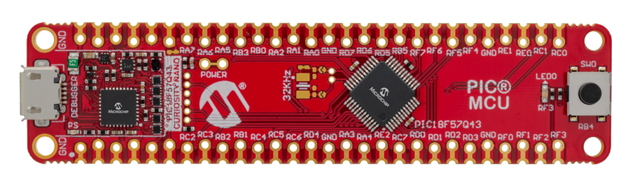
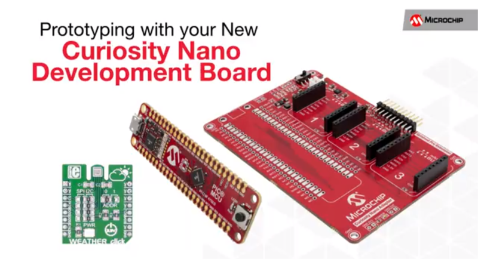
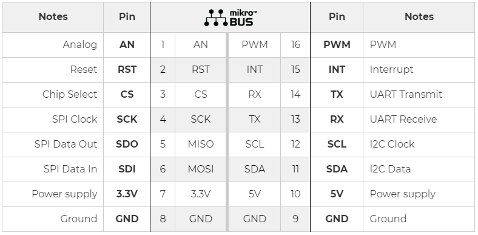
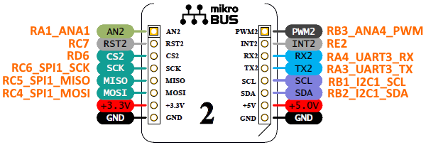
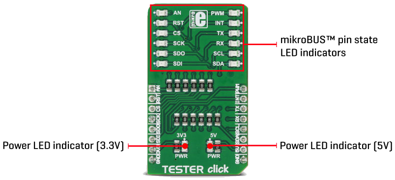
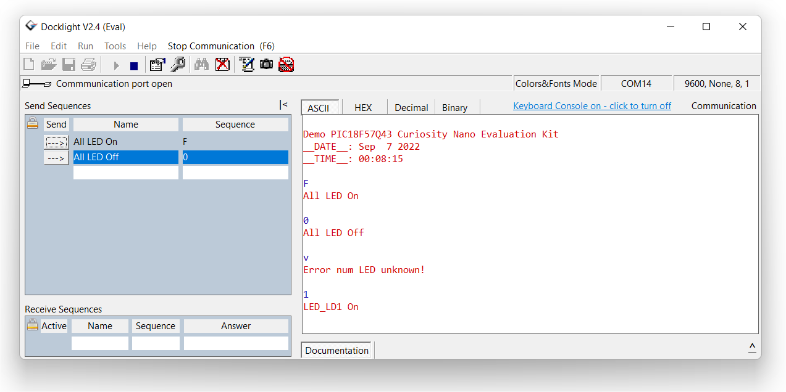

# Microchip Modbus RTU implémenter sur PIC18F57Q43

Création d'une implémentation du protocole Modbus RTU sur microcontrôleur PIC.

## Matériels et logiciels nécessaires

* Une [carte PIC18F57Q43 Curiosity Nano](https://www.microchip.com/en-us/development-tool/DM164150) (vous pouvez la trouver sur Microchip Direct, mais aussi sur Mouser, Digikey et d'autres magasins de composants électroniques en ligne en recherchant le code DM164150). 
Voir en bas de la page Internet de la carte la section documentation, le manuel d'utilisation et le schéma de la carte est disponible.
* Une carte mère [CURIOSITY NANO BASE FOR CLICK BOARDS™ (Part Number: AC164162)](https://www.microchip.com/en-us/development-tool/AC164162)
* Un module [TESTER CLICK (PID: MIKROE-3083)](https://www.mikroe.com/tester-click)
* Un [câble USB type A vers USB micro B](https://media.ldlc.com/r374/ld/products/00/01/20/16/LD0001201600_2.jpg)
* La dernière version de MPLAB X IDE, ici la version utilisée est la [v6.00](https://www.microchip.com/mplab/mplab-x-ide)
* La dernière version du compilateur XC8, la version utilisée est la [v2.40](https://www.microchip.com/en-us/development-tools-tools-and-software/mplab-xc-compilers#MPLAB%20XC%20Compiler%20Choices) (celle-ci est utilisé à la fois pour les PIC et les AVR)
* Logiciel ce communication série [Docklight V2.4](https://docklight.de/downloads/)

---

## Carte CuriosityNano PIC18F57Q43

<html>
<!-- Tableau simple avec en-tête -->

<a href="https://docs.google.com/document/d/1mcOm10D477hyFiMuCVZdUryhYyRF4xZHGxpxrDaOEMk/edit?usp=sharing" title="Curiosity Nano Development Platform" target="_blank">
<table style="margin-left: auto; margin-right: auto;">
  <tr>
    <td></td>
    <td>PIC18F57Q43 Curiosity Nano Evaluation Kit</td>
  </tr>
</table>

</a>

</html>

<html>

<a href="https://www.microchip.com/design-centers/8-bit/development-tools/pic-hardware/curiosity-nano-development-platform" title="Curiosity Nano Development Platform" target="_blank">
<H2>Curiosity Nano Development Platform</H2>

</a>

</html>

<https://www.microchip.com/en-us/development-tool/AC164162>

### Utilisation du support mikroBUS™

[mikroBUS™ Standard](https://www.mikroe.com/mikrobus)

[CLICK BOARDS](https://www.mikroe.com/click)

| MCU's Pin & Net name | Description J5 | mikroBUS™ socket 2 | Description J6 | MCU's Pin & Net name |
| :------------------: | -------------: | :----------------: | :------------- | :------------------: |
|       RA1_ANA1       |            AN2 |                    | PWM2           |     RB3_ANA4_PWM     |
|         RC7          |           RST2 |                    | INT2           |         RE2          |
|         RD6          |            CS2 |                    | RX2            |     RA4_UART3_RX     |
|     RC6_SPI1_SCK     |            SCK |                    | TX2            |     RA3_UART3_TX     |
|    RC5_SPI1_MISO     |           MISO |                    | SCL            |     RB1_I2C1_SCL     |
|    RC4_SPI1_MOSI     |           MOSI |                    | SDA            |     RB2_I2C1_SDA     |
|                      |           3.3V |                    | 5V             |                      |
|                      |            GND |                    | GND            |                      |

[TESTER CLICK (PID: MIKROE-3083)](https://www.mikroe.com/tester-click)

[TESTER click schematic v100](https://download.mikroe.com/documents/add-on-boards/click/tester/tester-click-schematic-v100.pdf)

| Description      | MCU's Pin |
| :--------------- | :-------: |
| LED_LD1  - AN    |    RA1    |
| LED_LD2  - RST   |    RC7    |
| LED_LD3  - CS    |    RD6    |
| LED_LD4  - SCK   |    RC6    |
| LED_LD5  - MISO  |    RC5    |
| LED_LD6  - MOSI  |    RC4    |
| LED_LD7  - PWM   |    RB3    |
| LED_LD8  - INT   |    RE2    |
| LED_LD9  - RX    |    RA4    |
| LED_LD10 - TX    |    RA3    |
| LED_LD11 - SCL   |    RB1    |
| LED_LD12 - SDA   |    RB2    |

---

## Mise en oeuvre d'une l'UART

<progress id="avancement" value="20" max="100"></progress>

<progress value="75" max="100"></progress> 75%

<html>

Progression du projet :
       <progress id="avancement" value="50" max="100"></progress>
       
       <input type="button" onclick="modif(-10);" value="-">
       <input type="button" onclick="modif(10);" value="+">

</html>

<meter min="0" max="100" value="50">50 places</meter>

### Test du programme via le terminal sérial

---

## Liens Internet

* Microchip, [PIC18F57Q43 Curiosity Nano Evaluation Kit - Part Number: DM164150](https://www.microchip.com/developmenttools/ProductDetails/DM164150)
