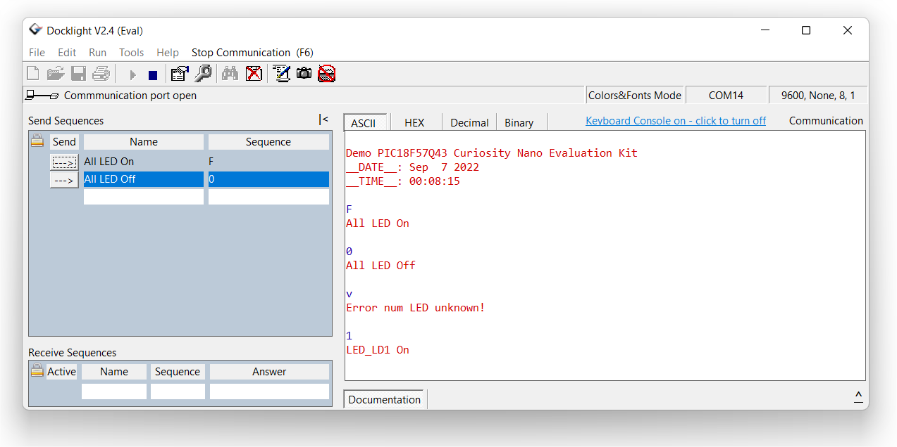

<h1>Présentation des programmes pour PIC18F57Q43</h1>

- [Le matériel et logiciel minumum requis](#le-matériel-et-logiciel-minumum-requis)
- [Carte CuriosityNano PIC18F57Q43](#carte-curiositynano-pic18f57q43)
- [Projet de mise en oeuvre simple du module UART](#projet-de-mise-en-oeuvre-simple-du-module-uart)
  - [Premimer test du programme via le terminal sérial](#premimer-test-du-programme-via-le-terminal-sérial)
- [Evolution du programme de mise en oeuvre simple de l'UART](#evolution-du-programme-de-mise-en-oeuvre-simple-de-luart)
  - [Vu du terminal sérial](#vu-du-terminal-sérial)
- [Projet de mise en oeuvre avancée du module UART](#projet-de-mise-en-oeuvre-avancée-du-module-uart)
- [A venir...](#a-venir)
- [Liens Internet](#liens-internet)

---

## Le matériel et logiciel minumum requis

* Une [carte PIC18F57Q43 Curiosity Nano](https://www.microchip.com/en-us/development-tool/DM164150) (vous pouvez la trouver sur Microchip Direct, mais aussi sur Mouser, Digikey et d'autres magasins de composants électroniques en ligne en recherchant le code DM164150). 
Voir en bas de la page Internet de la carte la section documentation, le manuel d'utilisation et le schéma de la carte est disponible.
* La dernière version de MPLAB X IDE, ici la version utilisée est la [v6.00](https://www.microchip.com/mplab/mplab-x-ide)
* La dernière version du compilateur XC8, la version utilisée est la [v2.40](https://www.microchip.com/en-us/development-tools-tools-and-software/mplab-xc-compilers#MPLAB%20XC%20Compiler%20Choices) (celle-ci est utilisé à la fois pour les PIC et les AVR)

---

## Carte CuriosityNano PIC18F57Q43

<html>
<!-- Tableau simple avec en-tête -->

<a href="https://docs.google.com/document/d/1mcOm10D477hyFiMuCVZdUryhYyRF4xZHGxpxrDaOEMk/edit?usp=sharing" title="Curiosity Nano Development Platform" target="_blank">
<table style="margin-left: auto; margin-right: auto;">
  <tr>
    <td></td>
    <td>PIC18F57Q43 Curiosity Nano Evaluation Kit</td>
  </tr>
</table>

</a>

</html>

---

## Projet de mise en oeuvre simple du module UART

Première mise en oeuvre de l'UART, echo des données reçues et envoie d'une trame lors de l'appuis sur le bouton poussoir.

[Switch Branch][1] : `git switch basic-use-of-uart`

### Premimer test du programme via le terminal sérial

---

## Evolution du programme de mise en oeuvre simple de l'UART

Suite de la mise en oeuvre de l'UART, envoie d'une trame lors de l'appuis sur le bouton poussoir et pilotage de 12 LED.

[Switch Branch][2] : `git switch basic-use-of-uart-with-led-control`

### Vu du terminal sérial

---

## Projet de mise en oeuvre avancée du module UART

Premier pas dans la mise en oeuvre d'une machine à états pour la réception d'une trame.

[Switch Branch][3] : `git switch advanced-use-of-uart-with-fsm`

---

## A venir...

Implémentation du protocole Modbus RTU sur microcontrôleur Microchip PIC18F57Q43, création d'une implémentation du protocole Modbus RTU sur microcontrôleur PIC.

---

## Liens Internet

* [Wikipedia Modbus](https://fr.wikipedia.org/wiki/Modbus)
* [Cours Liaison série Modbus RS 485](http://www.ac-grenoble.fr/ecole.entreprise/CRGE/cteressources/modbus/Protocole_Modbus.pdf)
* [Modbus RTU frame description](https://ozeki.hu/p_5854-modbus-rtu.html)
* Microchip, [PIC18F57Q43 Curiosity Nano Evaluation Kit - Part Number: DM164150](https://www.microchip.com/developmenttools/ProductDetails/DM164150)
* Blog, [PIC18F57Q43 Curiosity Nano + MPLAB Code Configurator](https://www.settorezero.com/wordpress/curiosity-nano-code-configurator-per-entrare-nel-mondo-dei-microcontrollori-pic-senza-sforzo-e-in-economia/)
* GitHub, [Cyb3rn0id / Microchip_Curiosity_Nano_Examples](https://github.com/Cyb3rn0id/Microchip_Curiosity_Nano_Examples)

<!-- Ci-dessous les liens en références dans ce fichier -->

[1]: https://github.com/ArnauldDev/Microchip-Modbus-RTU-on-PIC18F57Q43/tree/basic-use-of-uart
[2]: https://github.com/ArnauldDev/Microchip-Modbus-RTU-on-PIC18F57Q43/tree/basic-use-of-uart-with-led-control
[3]: https://github.com/ArnauldDev/Microchip-Modbus-RTU-on-PIC18F57Q43/tree/advanced-use-of-uart-with-fsm
